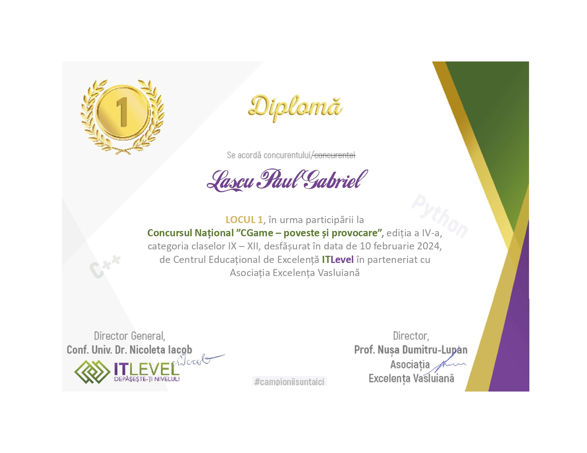

# CGame-Contest-Maze

This project was created for the CGame contest organized by Itlevel. It won the first place with a perfect score of 100 points.

## Project Description

In the Realm of Elements, a magical world full of enchantment, the five elements - Water, Wood, Fire, Metal, and Earth - coexist in harmony. However, the fragile balance of this world is threatened by a dark and mysterious force known as the Mystic Shadow.

To restore harmony and light in the Realm of Elements, our heroes - Aqua, Sylvanus, Ignis, Aurum, and Terra - embark on a daring adventure to confront the Mystic Shadow and bring back light and balance.

On your journey, you will encounter enemies and must either avoid them or fight them. Your goal is to reach the light and return, while staying alive, to restore balance in the Realm of Elements.

## How to Play

1. Choose your hero from the list of available heroes.
2. Navigate through the maze, avoiding or fighting enemies.
3. Use your hero's abilities to overcome obstacles and defeat enemies.
4. Reach the magical light to restore balance in the Realm of Elements.

## Links

- [CGame Contest Details](https://www.itlevel.ro/concurs-national-cgame-poveste-si-provocare-editia-aiv-a/)
- [Contest Results](https://www.itlevel.ro/wp-content/uploads/2024/02/Afisare-punctaj-Liceu-CGame2024.pdf)

## Award



## Usage

Run the main script to start the game:
```bash
python3 main.py
```
